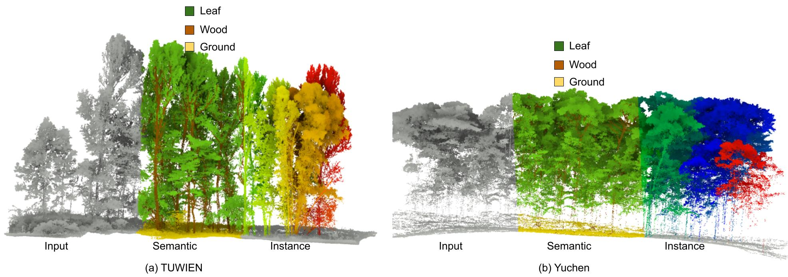

# ForestQuery: Boundary-Aware and Spatially Anchored Query Learning for Unified Forest Point Cloud Segmentation

[[Website]](https://zhan994.github.io/ForestQuery)
[[Paper]](https://arxiv.org/abs/2610.03403) 

## Overview

**ForestQuery is a unified framework for semantic and individual-tree segmentation of forest point clouds.
It combines boundary-aware instance query modeling with spatially anchored semantic queries to improve tree delineation and semantic understanding in complex forest scenes.
The method is evaluated across diverse forest environments and sensing conditions with strong cross-domain generalization.**

## News

***The code will be released very soon ...***
